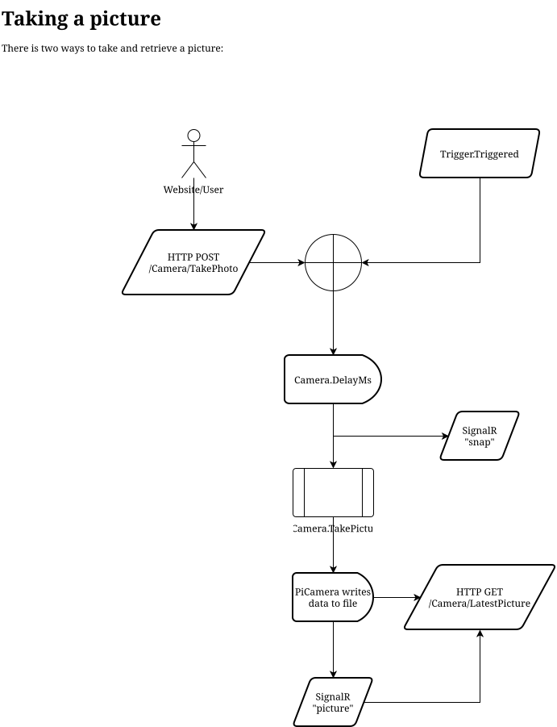

# Fotografie bewegter Objekte

Takes a picture using [`rpicam-still`](https://www.raspberrypi.com/documentation/computers/camera_software.html#rpicam-still) when a GPIO Pin (Trigger) is set high.
Additionally sets off a flash by setting pulling GPIO-Pin high.

Both flash and camera are set off on a configurable delay after trigger.

## Getting Started

### Build Requirements

- [ASP.NET 9 SDK](https://dotnet.microsoft.com/en-us/download/dotnet/9.0)
- [node.js](https://nodejs.org/en)
- [npm](https://www.npmjs.com/)

### Build

Use the provided [`build.sh`](build.sh) script.

The script will generate the current OpenApi definition ([`API/API.json`](API/API.json)), build the website and generate the executable.

To debug locally, set Environment-Variable `NUXT_PUBLIC_OPEN_FETCH_API_BASE_URL=http://127.0.0.1:5000/` (or where API is hosted, see [OpenFetch](https://nuxt-open-fetch.norbiros.dev/setup/configuration)).

### Run
#### Requirements

- [ASP.NET 9](https://dotnet.microsoft.com/en-us/download/dotnet/9.0)

#### Start

Execute the generated `API.dll` with `dotnet API.dll`. The program will provide a static Webserver at `0.0.0.0:5000` and a Swagger Endpoint definition overview at `/swagger`.

## Built with

- [ASP.NET 9](https://dotnet.microsoft.com/en-us/download/dotnet/9.0)
- [System.Device.Gpio](https://github.com/dotnet/iot) Wrapper for GPIO
- [Openur.Mono.Unix](https://github.com/mono/mono.posix) POSIX signals for `rpicamera-still`
- [Microsoft.AspNetCore.OpenApi](https://github.com/Microsoft/OpenAPI.NET) Auto generates [`API/API.json`](API/API.json)
- [node.js](https://nodejs.org/en)
- [npm](https://www.npmjs.com/)
- [Swashbuckle.AspNetCore.SwaggerUI](https://github.com/domaindrivendev/Swashbuckle.AspNetCore) Webinterface for [`API/API.json`](API/API.json)
- [Nuxt](https://nuxt.com/) Vue Framework for Webinterface
  - [Nuxt UI](https://ui.nuxt.com/) Component Library for UI
    - [tailwindcss](https://tailwindcss.com/) Stylesheets
  - [NuxtOpenFetch](https://nuxt-open-fetch.norbiros.dev/) Auto generates a typesafe composable for Endpoint interaction

# Taking a picture

